```mermaid
flowchart LR
    A[Tutorial 👉 👨‍🏫 ] -->
    B[Project 👉 🚧]
```

# Mediapipe Complete Course

> This comprehensive Mediapipe course covers essential modules including **Face Detection, Face Mesh, Hand Landmarks Detection, Pose Detection, and Selfie Segmentation**. Each module features step-by-step tutorials and practical projects to enhance your learning experience and help you apply these skills in real-world applications. The course begins with setting up your development environment in VS Code

## **Table of Content**

### [YouTube Playlist](#)

---
First there will complete video how to setup development enviornment for mediapipe in Vs Code 

### Setup Development Enviroment 

| No: | Topic Name | Status    | Type       | YouTube Video 🎥 Link | Thumbnail 🖼️ |
|-----|---------------|--------|------------|-----------------------|---------------|
| 1   | Setup Development Env | ❌ | Tutorial 👨‍🏫 | Pending...  | Video's thumbnail    |

### Face Detection

| No: | Topic Name | Status    | Type       | YouTube Video 🎥 Link | Thumbnail 🖼️ |
|-----|---------------|--------|------------|-----------------------|---------------|
| 1   | Face Detection  | ❌ | Tutorial 👨‍🏫 | Pending...  | Video's thumbnail    |
| 2   | Project1 | ❌      | Project 🚧   | Pending... | Video's thumbnail |
| 3   | Project2  | ❌      | Project 🚧   | Pending... | Video's thumbnail |

---

### Hand Detection

| No: | Topic Name               | Status | Type         | YouTube Video 🎥 Link | Thumbnail 🖼️|
|-----|--------------------------|--------|--------------|----------------------|-------------|
| 1   | Hand Landmarks Detection | ❌      | Tutorial 👨‍🏫 | Pending...| Video's thumbnail|
| 2   | Project 1 | ❌ | Project 🚧   | Pending...| Video's thumbnail|
| 3   | Project2 | ❌ | Project 🚧   | Pending...| Video's thumbnail|

---

### Face Mesh

| No: | Topic Name | Status | Type         | YouTube Video 🎥 Link | Thumbnail 🖼️|
|-----|------------|--------|--------------|----------------------|-------------|
| 1   | Face Mesh  | ❌ | Tutorial 👨‍🏫 | Pending...  | Video's thumbnail|
| 2   | Project 1     | ❌ | Project 🚧   | Pending... | Video's thumbnail|
| 3   | Project 2     | ❌ | Project 🚧   | Pending... | Video's thumbnail|

---

### Pose Estimation

| No: | Topic Name      | Status | Type         | YouTube Video 🎥 Link |Thumbnail 🖼️|
|-----|-----------------|--------|--------------|----------------------| -----------|
| 1   | Pose Estimation | ❌ | Tutorial 👨‍🏫 | Pending...  |Video's thumbnail|
| 2   | Project 1          | ❌ | Project 🚧   | Pending... | Video's thumbnail|
| 3   | Project 2       | ❌ | Project 🚧   | Pending... | Video's thumbnail|

---

### Selfie Segmentation

| No: | Topic Name          | Status | Type         | YouTube Video 🎥 Link |Thumbnail 🖼️|
|-----|---------------------|--------|--------------|----------------------|------------|
| 1   | Selfie Segmentation | ❌ | Tutorial 👨‍🏫 | Pending... | Video's thumbnail|
| 2   | Project 1              | ❌ | Project 🚧   | Pending...| Video's thumbnail|
| 3   | Project 2           | ❌ | Project 🚧   | Pending...| Video's thumbnail|

---

## 📫 Connect With Us! :wave:

Stay connected and follow us for updates, tutorials, and support. Reach out anytime if you have questions or need help with your projects!

  
  
  
  
  
  

---

💬 **Have a question or need help with your project?** 
Feel free to DM us on <a href="https://www.instagram.com/aiphile17" target="_blank">Instagram</a>!

  

